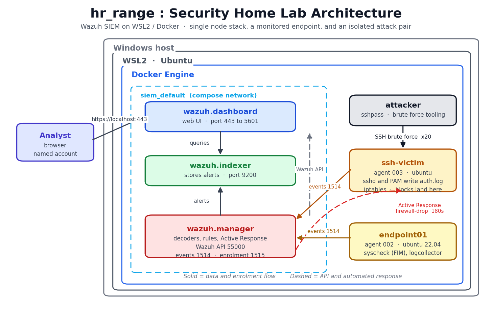
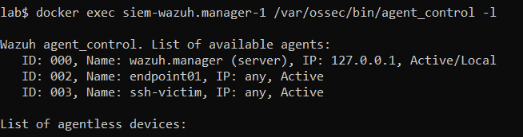
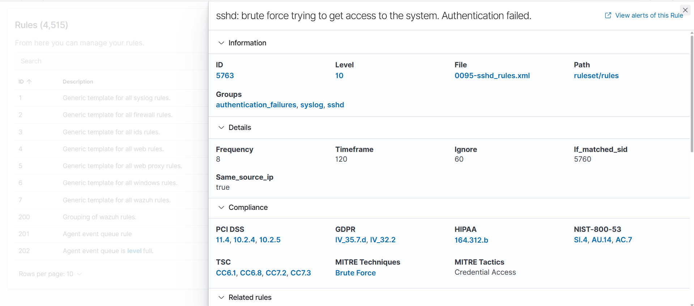
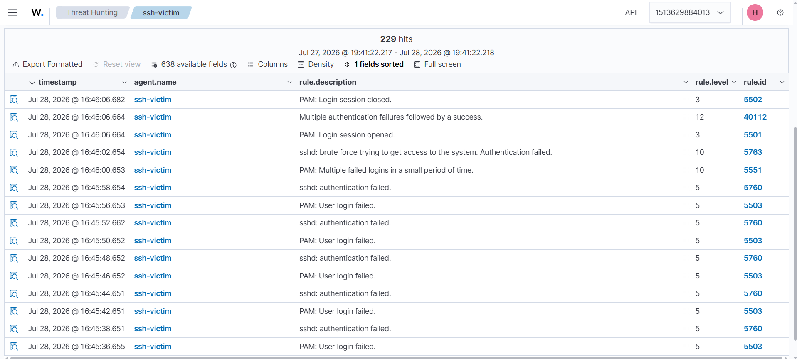
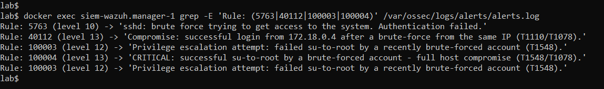
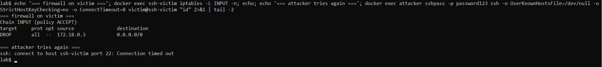
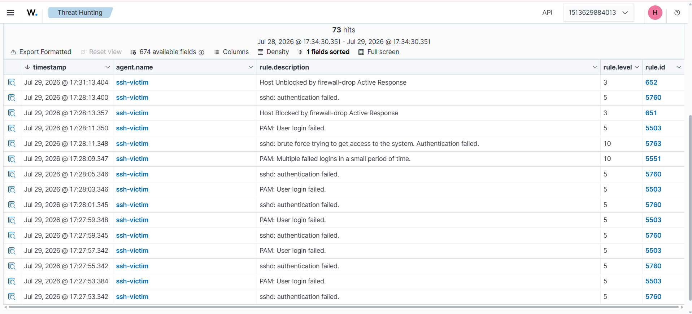
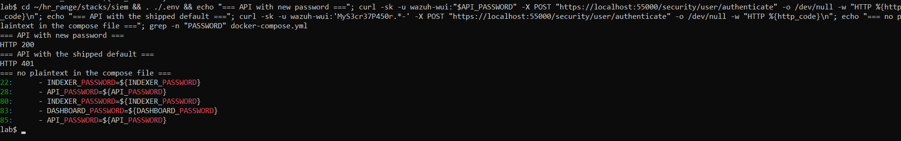

# Wazuh SIEM Detection Lab

I built a SIEM from scratch, wrote my own detection rules, attacked the lab, and checked that the rules actually caught it.

The attack is a common one. Someone guesses an SSH password until they get in, then tries to become root. I wanted to catch every stage of that, not just the first one, and I wanted the system to block the attacker on its own.

Everything runs in Docker on one laptop. Every detection below was triggered by a real attack in the lab and checked afterwards. None of it was tested only in a rule simulator.

## Contents

- [Technology stack](#technology-stack)
- [Platform choice: containers over virtual machines](#platform-choice-containers-over-virtual-machines)
- [Architecture](#architecture)
- [1. Brute force detection and automatic response](#1-brute-force-detection-and-automatic-response)
- [2. Post exploitation detection](#2-post-exploitation-detection)
- [3. Credential hardening](#3-credential-hardening)
- [Problems encountered](#problems-encountered)
- [Verification](#verification)
- [Lessons learned](#lessons-learned)
- [Reproducing the lab](#reproducing-the-lab)

## Technology stack

| Tool | What I used it for |
|---|---|
| Wazuh 4.14.5 | The SIEM itself. It collects logs, matches them against rules, and raises alerts |
| Docker and Docker Compose | Runs every part of the lab as a container |
| Wazuh Active Response | Blocks an attacker automatically when a rule fires |
| OpenSearch security tools | Changing the passwords Wazuh ships with |
| sshpass and OpenSSH | The attack itself |
| iptables | The Linux firewall, where the automatic blocks land |
| Git | Version control for the rules and configuration |

A SIEM is a Security Information and Event Management system. It gathers logs from different machines in one place, applies rules to them, and tells you when something looks wrong.

## Platform choice: containers over virtual machines

I built this lab twice.

The first version used VMware, with three full virtual machines: a Kali attacker, a Windows Server victim, and an Ubuntu machine running the SIEM. It worked, but it needed over 60 GB of disk space, which my laptop could not spare. Every time I changed a setting I had to wait for whole operating systems to boot.

So I rebuilt it in Docker.

| | VMware | Docker |
|---|---|---|
| Disk space | Over 60 GB for three machines | About 7.5 GB of images, shared between all the containers |
| Rebuilding after a change | Minutes, and manual | Seconds, with one command |
| How realistic | Full separate operating systems | Containers share the host's kernel |
| Sharing it with someone | Not really possible | A few text files anyone can run |

Almost all of that 7.5 GB is the three Wazuh images. The attacker and victim add hardly anything, because containers share image layers instead of each carrying a whole operating system inside them. That sharing is the real reason containers are smaller.

**What I gave up.** Containers share the kernel with the host, so anything that attacks the kernel itself, or anything Windows specific, is out of scope here.

**Why that was worth it.** This lab is about detecting things in logs. An SSH daemon writes the same lines to `auth.log` inside a container as it does on a virtual machine, and those lines are what my rules read. So the part that matters is unchanged, and in return the whole lab became a handful of text files I can destroy and rebuild in under a minute. When you are writing rules, you rebuild constantly, so that mattered more than kernel isolation did.

## Architecture



The whole thing runs inside Docker on WSL2, which is Windows Subsystem for Linux.

The **attacker** and **ssh-victim** containers sit on an internal network with no SSH port exposed to the outside, so the password guessing never leaves my machine. The victim runs a Wazuh agent, which is a small program that ships its logs to the manager.

The **manager** is where the rules live and where alerts are created. The **indexer** stores them. The **dashboard** is the web interface I use to search through them.

**endpoint01** is a second monitored machine. It is not part of the attack, and it exists so the manager has a source of ordinary everyday logs sitting alongside the attack ones.



## 1. Brute force detection and automatic response

Wazuh comes with a rule for this already. Rule **5763**, level 10, mapped to the MITRE technique **T1110 Brute Force**.



I spent time reading that rule before writing anything of my own, and it was worth it. The panel tells you exactly what has to happen for it to fire:

- **Frequency 8**, so it needs eight failed logins
- **Timeframe 120**, so those eight have to happen within two minutes
- **Same_source_ip true**, so they all have to come from one address

That is why my attack script tries 20 passwords quickly from a single container. Five slow attempts from different places would never trigger it, and I would have concluded the rule was broken.

**Ignore 60** caught me out later. After the rule fires, it goes quiet for 60 seconds. If you run two attacks close together, the second one produces a kill chain with no brute force alert in it, while every later rule still fires. It looks like a broken detection and is actually the rule doing what it was told.

Once the rule fires, Wazuh runs a script that blocks the attacker. I set this up in the manager's configuration:

```xml
<active-response>
  <command>firewall-drop</command>
  <location>local</location>
  <rules_id>5763</rules_id>
  <timeout>180</timeout>
</active-response>
```

`location: local` means the block runs on the machine that raised the alert, which is the victim. The alternative would be blocking centrally, which makes no sense here.

`timeout: 180` means the block lifts itself after three minutes. In a lab that matters, because otherwise you end up with a firewall full of old blocks that get in the way of the next test. It also means the SIEM records both a block and an unblock, which is nice to be able to show.

## 2. Post exploitation detection

Blocking a password guessing attempt is the easy part. The harder question is what you catch **after** someone gets in.

Here is the full sequence and what catches each stage:

```
The attacker                 The victim machine              What Wazuh sees
     |                            |                               |
     |-- guesses 20 passwords --> |-- auth.log: Failed --------->  5763    level 10
     |                            |                               |
     |                            |                               \-- blocks the attacker
     |                            |
     |-- logs in successfully --> |-- Accepted password ------->   40112   level 13
     |                            |                               (this one carries the attacker's IP)
     |                            |
     |-- tries to become root --> |-- su: FAILED SU ----------->   100003  level 12
     |                            |
     |-- becomes root ----------> |-- opened for user root ---->   100004  level 13
```

| Rule | Level | What it means |
|---|---|---|
| 40112, a built in rule I overwrote | 13 | Someone logged in successfully right after failing repeatedly from the same address. That is an account being taken over |
| 100003, mine | 12 | A recently attacked account is **trying** to become root |
| 100004, mine | 13 | A recently attacked account **succeeded** in becoming root. The machine is fully compromised |

Here are the rules themselves:

```xml
<group name="local,syslog,sshd,pam,su,">

  <!-- Wazuh already had a rule for this. Rather than write my own,
       I overwrote theirs to raise the level, add the T1110 tag,
       and put the attacker's IP into the alert text. -->
  <rule id="40112" level="13" timeframe="240" overwrite="yes">
    <if_group>authentication_success</if_group>
    <if_matched_group>authentication_failures</if_matched_group>
    <same_source_ip />
    <description>Compromise: successful login from $(srcip) after a brute-force from the same IP (T1110/T1078).</description>
    <mitre><id>T1110</id><id>T1078</id></mitre>
    <group>authentication_success,attack,</group>
  </rule>

  <rule id="100004" level="13" timeframe="600">
    <if_sid>5501</if_sid>
    <match>opened for user root</match>
    <if_matched_sid>5763</if_matched_sid>
    <description>CRITICAL: successful su-to-root by a brute-forced account - full host compromise (T1548/T1078).</description>
    <mitre><id>T1548</id><id>T1078</id></mitre>
    <group>authentication_success,attack,privilege_escalation,</group>
  </rule>

  <rule id="100003" level="12" timeframe="600">
    <if_sid>5301</if_sid>
    <if_matched_sid>5763</if_matched_sid>
    <description>Privilege escalation attempt: failed su-to-root by a recently brute-forced account (T1548).</description>
    <mitre><id>T1548</id></mitre>
    <group>authentication_failed,attack,privilege_escalation,</group>
  </rule>

</group>
```

**The order of the rules matters.** Rule 100004 is a narrower version of an existing rule, so it has to come first. If a broader rule is checked before it, the broader one wins and the root compromise alert never appears.

**One trade off I made on purpose.** Overwriting rule 40112 makes it apply to every successful login, not only SSH ones. That is fine here, because SSH is the only way into this lab. Somewhere with several login methods it would need narrowing down first.

## 3. Credential hardening

Wazuh ships with published default passwords, and mine were still using them. Three accounts: `admin` and `kibanaserver` on the indexer, and `wazuh-wui` for the manager's API.

I had created my own login earlier and assumed that dealt with it. It did not. Creating an account **adds** a user. It does not remove the ones that came with the software. `admin` was still there, still using a password anyone can look up, and the containers were still logging in as it every time they started.

What I changed:

- All three passwords replaced with 32 character random ones
- **Four unused accounts deleted instead of given new passwords.** `logstash`, `snapshotrestore`, `kibanaro` and `readall` were not used by anything. A renamed account is still an account someone can attack. A deleted one is not. The count went from seven down to three
- Every password moved into a `.env` file that git ignores, with the configuration files pointing at variables instead of real values
- The two config files that hold credentials removed from git, with example versions committed in their place so someone else can still set the lab up

## Problems encountered

### Custom rule shadowed by a built in rule

I spent days on a rule to catch a successful login straight after a failed run of attempts. It passed every test I ran on it. It never fired during a real attack.

The obvious conclusion is that the rule is wrong, so I rewrote it. Several times. That got me nowhere.

**The rule was fine. Something else was firing instead of it.**

Wazuh only raises **one alert per log line**. When several rules could match, it picks one and the others never run. A rule that Wazuh already ships, number 40112, matched the same log lines mine did, and it won every time.



You can see it there in the middle of the attack, firing at level 12.

What finally found it was changing the question. Instead of asking "why is my rule not firing", I asked **"what alert did this log line actually produce"**, and traced it through the raw alert data. That took minutes after days of guessing.

The annoying part is that 40112 was already doing exactly what I was trying to build, and doing it better, because it also carried the attacker's IP address, which mine did not. **If I had searched the rules Wazuh already ships before writing my own, I would have skipped the whole thing.**

So I stopped competing with it and overwrote it instead. Same rule, raised to level 13, with the attacker's IP in the alert text.

### An incorrect conclusion and its downstream cost

While debugging the above I recorded a conclusion:

> Rule 5715 works in the simulator but never fires during a real attack, so build on rule 5501 instead.

That was wrong. Rule 5715 does fire, and it does carry the attacker's IP.

What I had actually seen was **my** rule failing. I assumed the rule above it had failed too. Two different things, one conclusion, and it was the wrong one.

That mistake cost me real time. I rebuilt everything on rule 5501, which does not include a source IP address. So the alerts I produced had no attacker address in them, and anything downstream had nothing to work with. One confident note, written once, shaped a week of work.

**If a rule that depends on another rule fails, that tells you nothing about the rule underneath. Check it separately.**

### Two separate credential stores

Changing the passwords was harder than expected, because Wazuh keeps users in two different systems that are changed in completely different ways.

The **indexer** keeps its users in a file of hashed passwords, pushed into the running system with a command line tool. The **manager's API** does not use that file at all. Its user is set from an environment variable when the container starts.

On top of that, the settings in the Docker configuration are only what each container **sends** when it logs in. Changing those alone does not change the password on the other side. It just breaks the login and takes the dashboard offline. Both halves have to change together.

### A configuration tool that replaces rather than merges

The tool that pushes the indexer's user list **replaces the whole thing**. It does not merge.

My own login had been created through the web interface, so it existed in the running system but was not in the file stored with the project. Pushing that file would have deleted my own account without warning.

I caught it before running it. The safe habit is to export the live configuration first and edit that copy, never the one sitting in version control.

### A verification command that could not fail

To confirm the new passwords had reached the containers, I hid the values while printing the file, using this:

```
sed 's/=.*/=<hidden>/'
```

The problem is that `.*` matches nothing as happily as it matches something. An empty password printed exactly the same as a real one. The check passed while one password was completely blank, through two failed attempts to restart the stack, and told me everything was fine.

This works instead:

```
awk -F= '{print $1": "length($2)" chars"}' .env
```

It prints how many characters each password has, without printing the password. Zero characters is obviously wrong. The first version could only ever look correct.

## Verification

### Full attack chain detection

I run the attack, then read the alerts:



```
Rule: 5763   (level 10) -> sshd: brute force trying to get access to the system. Authentication failed.
Rule: 40112  (level 13) -> Compromise: successful login from 172.18.0.4 after a brute-force from the same IP (T1110/T1078).
Rule: 100003 (level 12) -> Privilege escalation attempt: failed su-to-root by a recently brute-forced account (T1548).
Rule: 100004 (level 13) -> CRITICAL: successful su-to-root by a brute-forced account - full host compromise (T1548/T1078).
```

Rule 40112 includes the attacker's address, which is the whole reason I overwrote it rather than writing my own. The address changes each time, because Docker assigns it when the container starts, so the rule has to read it out of the log rather than have it written down anywhere.

### Active Response blocks the attacker



This is the screenshot I care about most. It shows three things in a row:

1. The password guessing runs and rule 5763 fires
2. A block for the attacker's address appears in the victim's firewall
3. **The attacker tries again and gets `Connection timed out`**

Showing a firewall rule proves a rule got written. Showing the attacker unable to connect afterwards proves it works.

### Block lifecycle and timeout



Rules **651** and **652** are Wazuh's own alerts for a host being blocked and unblocked. They appear three minutes apart, which is the timeout I configured. The response has a beginning and an end, and both are recorded.

### Credential rotation



The new password gets `HTTP 200`. The old default gets `HTTP 401`. And every password line in the Docker configuration points at a variable rather than a real value.

Checking that the **old password stops working** is the half people skip. Checking the new one works only tells you that you typed something in.

| What I checked | Result |
|---|---|
| API with the new password | `HTTP 200` |
| API with the default it shipped with | `HTTP 401` |
| Indexer with the new password | `status: green` |
| Indexer with the default | `Unauthorized` |
| Manager can still reach the indexer | `talk to server... OK` |
| Passwords in the Docker file | 5 lines, all variables |
| Accounts before and after | 7, then 3 |
| Full attack chain run again | All four rules still fire |

The last two matter most. The manager to indexer check catches the thing most likely to break quietly when you change an indexer password. Running the attack again proves detection still works. That is the difference between changing a password and changing a password without breaking the thing it protects.

## Lessons learned

**Look at what already exists before building your own.** Wazuh ships with over 4,500 rules. The one I spent days writing already existed, worked better than mine, and included data mine was missing.

**A rule that never fires might not be broken.** The useful question is not "what is wrong with my rule" but "what alert did this log line actually produce". One of those looks at what happened. The other guesses.

**One failed test is not a conclusion.** I watched my rule fail, decided the rule underneath had failed too, and built a week of work on that. They were different problems.

**A check that cannot fail is not a check.** Write your verification around the thing you are afraid of. Counting characters can come back as zero and tell you something is wrong. Hiding the value can only ever look fine.

**Find out what actually happened before working out why.** I had three wrong theories in a row about a password problem. Checking what the container had actually received answered it straight away.

**Deleting is better than renaming.** For accounts nothing uses, removing them takes the problem away completely instead of making it smaller.

**Running out of resources can improve a design.** I only moved to containers because I ran out of disk space. The result is smaller, faster to rebuild, and something I can hand to someone else as a few text files. The limitation produced a better lab than my original plan.

## Reproducing the lab

Three things have to happen before the stack will start.

The indexer needs a higher memory map limit than Linux gives by default, or it exits during startup. This one needs root:

```
sudo sysctl -w vm.max_map_count=262144
```

The three containers talk to each other over TLS, so the certificates have to be generated once:

```
cd stacks/siem && docker compose -f generate-indexer-certs.yml run --rm generator
```

Then copy each `.example` file to its real name and put your own passwords in. No working credentials are stored here, so nothing will authenticate until you do.

Now start it:

```
cd stacks/siem        && docker compose up -d    # give the indexer about 90 seconds
cd targets/ssh-victim && docker compose up -d
cd attacker           && docker compose up -d
```

The dashboard is at `https://localhost:443`. The certificate is self signed, so your browser will warn you.

Running the attack:

```
docker exec attacker sh -c 'for i in $(seq 1 20); do sshpass -p "bad$i" ssh -o StrictHostKeyChecking=no -o ConnectTimeout=3 victim@ssh-victim "id" 2>/dev/null; done'
docker exec ssh-victim iptables -F
docker exec attacker sshpass -p password123 ssh -o StrictHostKeyChecking=no victim@ssh-victim "id"
docker exec ssh-victim su - victim -c "echo rootpass123 | su -c whoami root"
```

Then read the alerts:

```
docker exec siem-wazuh.manager-1 grep -E 'Rule: (5763|40112|100003|100004)' /var/ossec/logs/alerts/alerts.log
```

**Clear the firewall between runs** with `docker exec ssh-victim iptables -F`. The attacker gets blocked after the password guessing, so the successful login step cannot connect until you do.

**Wait 90 seconds between runs**, or rule 5763 stays quiet and your alerts come out missing the first stage.

### Credentials in this repository

The victim machine has deliberately weak passwords, `victim:password123` and `root:rootpass123`, written into its Dockerfile. They are there to be guessed. I made them up for this lab, they are not used anywhere else, and the machine is only reachable from inside the lab's own network with no SSH port opened to the outside.
