# SOC Automation

A SIEM tells you something happened. This project makes something happen back.

When my lab raises a serious alert, a playbook picks it up automatically. It works out whether the attacker's address is worth investigating, looks it up against a threat intelligence service, emails me either way, and blocks the attacker if the alert says the account was actually taken over.

Every branch of it was tested twice: once to check it does the right thing, and once to check it refuses to do the wrong thing. That second half turned out to matter more than I expected.

## Contents

- [Technology stack](#technology-stack)
- [Architecture](#architecture)
- [1. Getting alerts out of the SIEM](#1-getting-alerts-out-of-the-siem)
- [2. Deciding which alerts are worth enriching](#2-deciding-which-alerts-are-worth-enriching)
- [3. Automated containment](#3-automated-containment)
- [4. The same decisions in Python](#4-the-same-decisions-in-python)
- [Problems encountered](#problems-encountered)
- [Verification](#verification)
- [Lessons learned](#lessons-learned)
- [Limitations](#limitations)
- [Reproducing the workflow](#reproducing-the-workflow)

## Technology stack

| Tool | What I used it for |
|---|---|
| Wazuh 4.14.5 | Raises the alerts and carries out the blocking |
| Shuffle | The automation platform where the playbook lives |
| VirusTotal API | Looking up the reputation and owner of an IP address |
| Shuffle's Http app | Making every API call in the playbook, to VirusTotal and to Wazuh |
| Gmail SMTP | Sending the alert emails |
| Wazuh Manager API | Triggering the block from the playbook |
| Docker and Docker Swarm | How Shuffle runs the small containers that do the work |
| Python, requests, pytest | Rewriting the playbook's decisions as code that can be tested |

SOAR stands for Security Orchestration, Automation and Response. It is a platform where you draw out what should happen when an alert arrives, instead of doing those steps by hand every time.

## Architecture

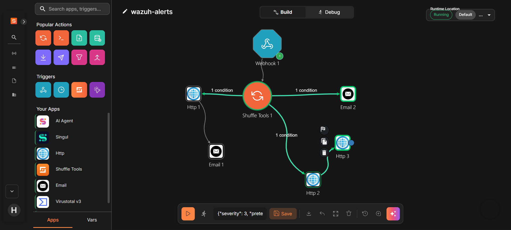

```
Wazuh raises an alert
        |
        v
    Webhook  ->  Splitter  ---> [ address is public ]  --> VirusTotal --> Email with the lookup results
                     |
                     |--------> [ address is private, or there isn't one ] --> Email without a lookup
                     |
                     |--------> [ the alert says the account was taken over ] --> Log in to Wazuh --> Block the attacker
```

In the screenshot the steps are named `Http 1`, `Http 2` and `Http 3` rather than by what they do. That is because all three are the same generic HTTP request node: one calls VirusTotal, and the other two log in to Wazuh and ask it to block the attacker. The diagram above names them by their job instead.

Wazuh posts every alert I care about to a webhook, which is just a URL that accepts data and starts the playbook running.

The **splitter** is there because of a limitation in Shuffle. A trigger can only lead to one thing, so if you want to branch three ways, you need one node immediately after it whose only job is to pass the alert along. It does nothing else, and in a bigger setup it would be the natural place to clean up or de-duplicate alerts before anything looks at them.

Each of the three branches has a condition on it, so any given alert goes down exactly one of them.

## 1. Getting alerts out of the SIEM

Wazuh has a built in way to send alerts somewhere else. I added this to its configuration:

```xml
<integration>
  <name>shuffle</name>
  <hook_url>http://host.docker.internal:3001/api/v1/hooks/...</hook_url>
  <rule_id>40112,100003,100004</rule_id>
  <alert_format>json</alert_format>
</integration>
```

The `rule_id` list keeps this narrow on purpose. Only three rules get forwarded: the one for an account being taken over, and the two for someone trying to become root. Everything else stays in the SIEM. An automation platform that receives every alert is an automation platform nobody trusts.

`host.docker.internal` instead of `localhost` matters here. Wazuh and Shuffle run in separate Docker networks, and inside the Wazuh container `localhost` means the Wazuh container itself. It took a moment to realise the URL that works in my browser is not the URL that works from inside a container.

## 2. Deciding which alerts are worth enriching

VirusTotal is a service that tells you what is known about an IP address: whether antivirus engines have flagged it, who owns the network it belongs to, and which country it is in.

I call its API directly, using Shuffle's generic **Http** app rather than the ready made VirusTotal app. That was not the plan, and the reason is [further down](#the-ready-made-app-cost-more-than-doing-it-by-hand).

That is useful information to have in an alert. But not every address is worth asking about, and there were two decisions to make here.

### Enrichment never decides whether you get told

The obvious way to build this is: look the address up, and only email me if VirusTotal says it is malicious.

I decided against that, and it is the most important decision in the project.

Most machines attacking servers over SSH are ordinary computers and cheap rented servers that somebody else has taken over. VirusTotal has usually never heard of them. If I only send an alert when VirusTotal already knows the address is bad, then a genuine break in produces **no alert at all** whenever the attacker is new, which is most of the time.

VirusTotal saying nothing does not mean the address is safe. It usually means nobody has reported it yet.

So the lookup adds information to the alert and helps me decide how urgent it is. It never decides whether the alert exists.

### Never look up an address VirusTotal cannot know

The attacker in my lab has an address on Docker's internal network, in the range `172.18.x.x`. Addresses like that are private, meaning they only exist inside a local network. Millions of separate networks use the same ones. VirusTotal has nothing to tell you about them, and the free plan only allows four lookups a minute, so asking about them wastes the allowance on a guaranteed non answer.

I wrote one pattern to recognise private addresses, and used it on two branches, inverted on one of them:

```
^(10\.|127\.|169\.254\.|192\.168\.|172\.(1[6-9]|2[0-9]|3[01])\.|$)
```

Two parts of that are doing real work.

**The `172.` range is not what people assume.** Private addresses in that range only run from `172.16` to `172.31`. `172.32.5.1` is a perfectly normal public address on the internet. If I had matched everything starting `172.` I would have quietly skipped the lookup on real attackers.

**The `|$` at the end matches an empty value.** Two of the three alerts I forward come from someone trying to become root, and those have no attacker address in them at all, because that action happens on the machine itself rather than over the network. Without that piece, an empty address fails the private test, so the branch for public addresses would run and VirusTotal would be asked about nothing.

## 3. Automated containment

The third branch blocks the attacker, and it only runs for one specific alert: the one that says someone logged in successfully straight after failing repeatedly.

There are two reasons for that. It is the only one of the three alerts that contains an attacker address, and you cannot block an address that is not there. And it is the right thing to act on. That alert means an account has actually been taken over, not that something looked suspicious.

Blocking takes two steps, because the Wazuh API hands out temporary passes rather than a permanent key:

1. Log in to the API and get a token that lasts about fifteen minutes
2. Use that token to ask Wazuh to run its blocking script

```json
{"command":"firewall-drop180","arguments":[],"alert":{"data":{"srcip":"the attacker's address"}}}
```

Which machine does the blocking is read out of the alert itself, so it always lands on whichever machine reported the problem rather than one I have written down somewhere.

### Why this duplicates something the SIEM already does

My SIEM already blocks attackers on its own when it sees password guessing. So this is deliberately doing something twice, and the reason is that they are different kinds of response.

The SIEM's own blocking is a **reflex**. It is tied to one rule, it happens in under a second, and it makes no decisions. That is exactly what you want at three in the morning when nobody is watching.

The playbook's blocking is **considered**. It can check conditions, use information from elsewhere, and leave a record of why it acted. That is what you want when someone asks afterwards what happened and why.

Real security teams run both, for the same reason a building has both a smoke alarm and a fire procedure.

## 4. The same decisions in Python

The playbook's decisions are now also written as a small Python script with tests, in [`enrichment/`](enrichment/). It reads a Wazuh alert, decides whether the attacker's address is worth looking up, asks VirusTotal if it is, and prints a summary.

It does not replace the playbook. It sends no email and blocks nothing. It exists because a drag and drop workflow cannot be tested, and the worst bug in this project was one that testing should have caught.

| Playbook step | In the script |
|---|---|
| Reading the attacker's address | `get_srcip()` |
| Reading the severity | `get_level()` |
| The private address pattern | `is_public()` |
| The VirusTotal Http node | `lookup_ip()` |
| The splitter and the three branch conditions | `summarize()` |

### The tests use real alerts

The alerts in `tests/fixtures/` were copied out of Wazuh's own alert log after a real attack run, not written by hand. Writing them by hand is how the playbook passed every test while being completely broken.

That paid off straight away. The first alert I pulled out said level 12, while my rules say 13. It was a month old, from before I raised that rule's level. A test built on it would have checked behaviour that no longer exists, so I ran the attack again and used the fresh alerts.

### A library instead of the pattern

The pattern worked, but Python's built in `ipaddress` module knows every reserved range, including some the pattern missed:

| Address | What it is | Pattern said | Script says |
|---|---|---|---|
| `172.32.5.1` | Public | public | public |
| `172.18.0.3` | My lab's attacker | private | private |
| `100.64.0.1` | Carrier grade NAT, an address an internet provider shares between customers | **public** | private |
| `224.0.0.1` | Multicast, an address for a group rather than one machine | **public** | private |
| `fe80::1` | A private IPv6 address | **public** | private |

One trap: the module's own `is_global` check calls multicast addresses public, so the script checks for multicast separately. A test caught that before any code relied on it.

### Enrichment still never decides whether you get told

`summarize()` always returns the alert. Anything that goes wrong with the lookup only changes one field:

| Situation | `enrichment` field |
|---|---|
| Private address, or no address | `skipped: no public IP` |
| No API key set | `skipped: no API key` |
| Rate limit (four lookups a minute on the free plan) | `{"error": "VirusTotal returned HTTP 429"}` |
| A web page comes back instead of data | `{"error": "VirusTotal did not return JSON"}` |
| No network | `{"error": "could not reach VirusTotal: ConnectTimeout"}` |
| Lookup worked | engines flagging it, network owner, country |

### Proving the tests can fail

All 21 tests pass. That only means something if they can fail, so I broke the code on purpose by removing the multicast check. Exactly one test failed, the one for `224.0.0.1`, and it named the address. Then I put the check back.

The tests that matter most are the refusals. They replace the VirusTotal call with a stand in that fails the test if it ever runs. That proves the script never looks up a private address or an alert with no address, which is the bug that sent the playbook to VirusTotal with an empty value.

The VirusTotal tests never touch the network. They swap in a fake reply, so a rate limit or a broken response can be tested at any time, with no API key.

### Running it

```
cd 02-soc-automation/enrichment
python3 -m venv .venv && source .venv/bin/activate
pip install -r requirements.txt
python -m pytest -q
python enrich.py tests/fixtures/alert_40112.json
```

On a real account takeover alert:

```json
{
  "rule": "40112",
  "level": 13,
  "description": "Compromise: successful login from 172.18.0.3 after a brute-force from the same IP (T1110/T1078).",
  "agent": "ssh-victim",
  "srcip": "172.18.0.3",
  "enrichment": "skipped: no public IP"
}
```

Lookups need a VirusTotal key in the `VT_API_KEY` environment variable. The key is never stored in this repository.

## Problems encountered

### Every run hung, and the error message blamed the wrong thing

Every test I ran sat there saying it was still executing and never finished. The interface said:

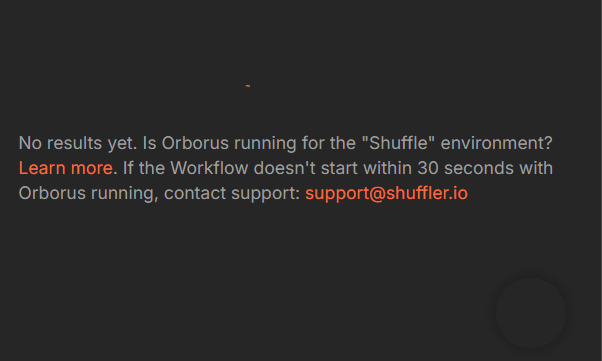

Orborus is the part of Shuffle that hands work out. It was running perfectly.

That message is a guess, and believing it would have cost me the afternoon. So I checked each layer in turn, asking a different question at each one:

1. **Did the work get handed out?** Orborus's own log said yes
2. **Did anything pick it up?** The worker's log said it received the job, called the app, and then waited forever
3. **Did the app get the request?** The app's log showed it had started up and nothing else. No request ever arrived
4. **Can they even find each other?** From inside the worker, looking up the app's name came back as "no such name"
5. **Why not?** Comparing which networks each container was attached to

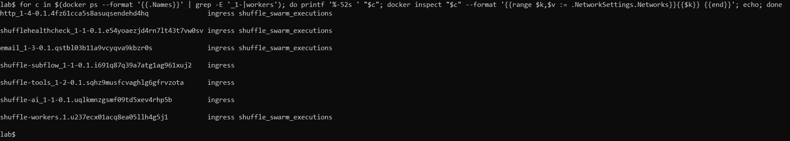

The app was attached to the wrong network. Shuffle's workers find the apps they need by name, over a shared network, and this one had been deployed without being connected to it. Two containers that had no way of seeing each other.

One command attached it, and it worked immediately. Three other apps had the same problem and three did not, which is why nothing looked broken from the outside. Only the specific app I needed was misconfigured.

**The lesson is about the error message.** It named the one component that was working correctly. Nothing gets found by trusting the first explanation an interface offers you.

### The ready made app cost more than doing it by hand

Shuffle has a VirusTotal app you can install instead of writing the API call yourself. I used it first, and it took longer than the work it was meant to save.

**It would not start.** The error said Docker could not find the image it needed. The app had been built on my machine under one name, and the action inside it asked for a slightly different one: a hyphen where there should have been an underscore, and a different version number. So Docker went looking on the internet for something that only existed locally under another name. A rename fixed it.

**Then the requests came back as a web page instead of data.** Two things were wrong at once. The address it was calling was VirusTotal's website rather than its API, and it was not sending my key at all. VirusTotal does not turn away unauthenticated requests cleanly. It sends you to the website, so a missing key looks exactly like a wrong address, and I spent a while fixing the wrong one.

At that point I replaced the whole thing with a plain HTTP request: set the address, add the key as a header, done. It worked first time, and I could see exactly what was being sent.

**A ready made integration is only a shortcut while it works.** The moment it does not, you are debugging somebody else's code with none of the visibility you would have had from writing the request yourself. Every API call in this playbook is now a plain HTTP node, including the two that talk to Wazuh.

### The workflow passed every test and was completely broken

This is the one worth reading.

I built the lookup step, tested it with alerts I wrote by hand, and both branches behaved perfectly. Public addresses got looked up. Private ones got skipped. I moved on.

Then I ran a real attack, and the emails arrived with every lookup field blank.

Wazuh does not send alerts in the shape I assumed. It wraps them, putting a few summary fields at the top and the actual alert nested inside. **The attacker's address was not where I thought it was.**

So on every real alert:

1. The field I was reading came back empty
2. An empty value did not match my private address pattern
3. Which meant the branch for public addresses ran, every time
4. Which asked VirusTotal about an address that was not there
5. Which returned "not found"

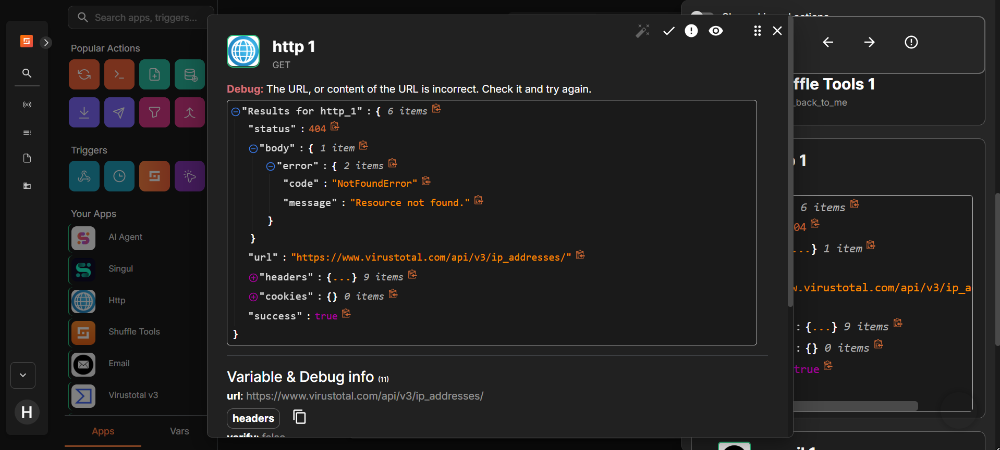

Look at the bottom of that panel. It says **`success: true`**. The request completed, so as far as that node was concerned everything was fine. The email step then reported that it had sent the email, which it had. The email was just empty.

**Every part of the chain reported success. The whole thing did nothing.**

This is what actually arrived in my inbox:

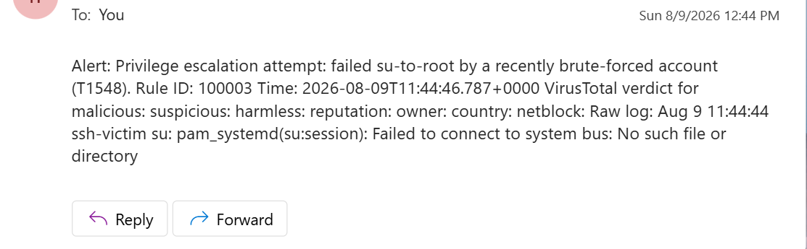

An alert email that tells you an account was compromised, followed by a list of empty fields. Worse than no email, because it looks like the lookup ran and found nothing worrying.

The reason my tests passed is that I wrote the test alerts myself, in the shape I believed Wazuh used. So they tested my assumption rather than the system. **A test that cannot fail is not a test.**

Fixing it meant capturing a real alert, looking at where the fields actually were, and using those paths instead. That also fixed a second bug I had not noticed: the emails had been reporting a severity of 3 on alerts that were actually level 13, because I was reading a different field with a similar name. An alert that understates how serious it is does more harm than no alert.

### Wazuh rejected a command that was in its own configuration

The blocking step failed with:

> The command used is not defined in the configuration.

The command was defined in the configuration. I was looking at it.

The API does not check the configuration file. It checks a list held on the machine doing the blocking:

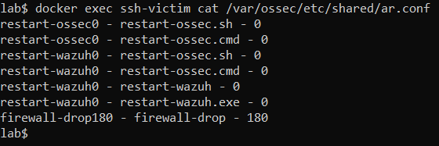

```
firewall-drop180 - firewall-drop - 180
```

The name has the timeout stuck on the end of it. Because I had set the block to last 180 seconds, the command became `firewall-drop180`. Change the timeout and the name changes with it, and the error message still points you at the file where the name looks correct.

### The block vanished before I could photograph it

The API said it had worked. The machine said it had run the command. The firewall was empty.

The block removes itself after 180 seconds, which is what that number in the name means. A successful command followed by an empty firewall is the **expected** result if you look more than three minutes later.

I checked by watching rather than guessing:

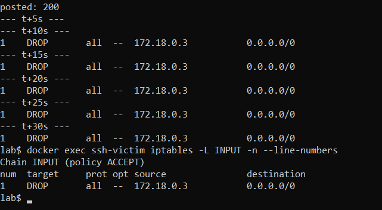

Nothing after five seconds. The block present from ten seconds onwards.

### Working out which system did the blocking

My SIEM blocks the attacker on its own, and now so does the playbook. Both block the same address, so seeing a block proves nothing about which one caused it.

Two things separated them. I tested the API using a made up address that the SIEM would never block, so anything that appeared could only have come from my playbook. And during full attack runs I cleared the firewall part way through, after the SIEM had already done its blocking, so anything appearing afterwards had to be the playbook.

### Three separate problems sending an email

The email step took longer than everything else combined.

**The default action was the wrong one.** Shuffle offers two ways to send email, and the one selected by default goes through Shuffle's own service and wants an account with them. It was never going to reach Gmail.

**A field that looked filled in was empty.** The port field showed `587` in grey. That was placeholder text rather than a value, and the field was actually blank. The error said the port needed to be a number, which sounds like I had typed something wrong, when the real problem was that I had typed nothing at all.

**Google rejected my password**, with `535 5.7.8 Username and Password not accepted`. Google stopped allowing normal account passwords for this years ago. It needs an app password, which is a separate one you generate specifically for this purpose, sixteen lowercase letters with no spaces.

**One security lesson from that session.** My account password ended up written into Shuffle's own logs, because platforms like this record the settings of every action they run. I revoked it immediately. If credentials have passed through a system, do not print its whole log to your screen.

### A condition that did not save

The blocking branch was supposed to only run for one specific alert. I set that up, and it did not save.

Blocking still worked in every test, because my test alert was that specific alert anyway, and a branch with no condition runs for everything. Right result, wrong reason.

The only sign was on the diagram itself. Two branches were labelled "1 condition" and the third was blank. What it actually meant was that every alert triggered a block, including ones with no attacker address in them, which produced blocking commands that blocked nothing.

**The label on the connector is the confirmation.** A saved condition shows up there. An unsaved one leaves it blank while everything carries on looking normal.

## Verification

### Each alert goes down exactly one branch

**A public address**, sent through as a test alert in the same shape Wazuh uses:

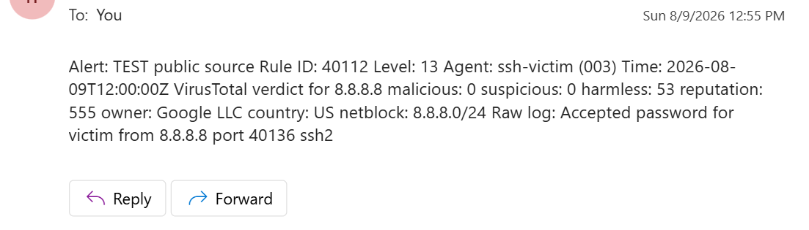

The lookup results came through: how many engines flagged it, who owns the network, which country. The other branch did not run.

**A private address, and an alert with no address at all**, from a real attack:

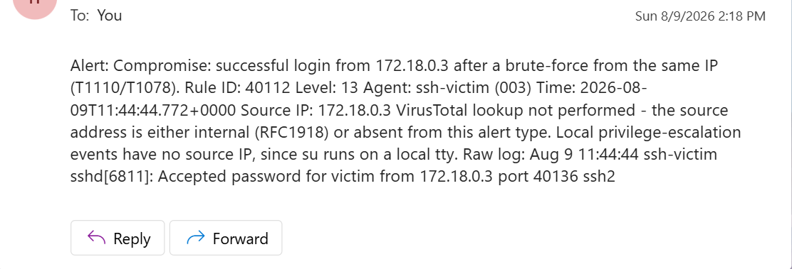

The account takeover alert has an address and it is correctly recognised as internal. The two privilege escalation alerts have no address at all and are handled by the same condition. The severity now reads correctly. VirusTotal was never called.

The conditions themselves:

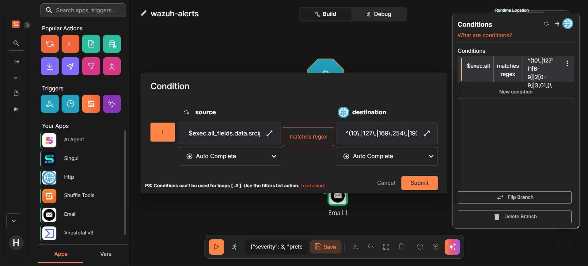

One pattern, used on two branches, with the toggle on the left inverting it for the branch that handles public addresses.

### Blocking runs when it should and refuses when it should not

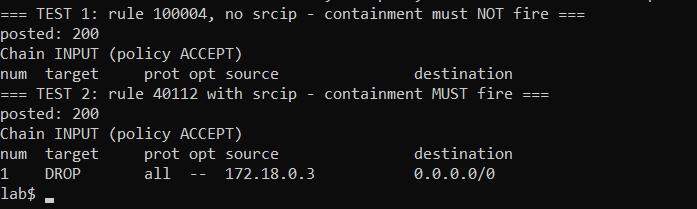

| What I sent | What should happen | What happened |
|---|---|---|
| A privilege escalation alert with no address | No block | Firewall stayed empty |
| An account takeover alert with an address | Block | Attacker's address blocked |

A check that lets the right thing through is only half a check. The half that matters is proving it stops the other one, and that is the half I nearly skipped.

## Lessons learned

**Error messages point where the person who wrote them guessed, not where the problem is.** The message that cost me the most time named the only component working properly.

**A test I wrote to match my assumption tested my assumption, not the system.** The alerts I made up had the shape I believed Wazuh used. Real ones did not. Test data has to come from the real thing.

**"Success" usually means the message was delivered, not that anything useful happened.** A failed lookup, an empty email, and two green ticks.

**A ready made integration is only a shortcut while it works.** The VirusTotal app was supposed to save me writing an API call. It cost more time than writing one, and gave me less visibility while it was failing.

**Debug at whatever level answers the question fastest.** Trying settings through a web interface took a minute per attempt. Testing the same thing from the command line took two seconds, and the error told me exactly which field was wrong each time.

**Check that things refuse, not just that they work.** Both real faults in this project were branches doing something they should not have, and both looked completely fine as long as I only tested the case that was supposed to work.

**Some decisions are judgement, not configuration.** Choosing not to make the alert depend on the threat intelligence lookup is the most consequential thing in this project, and nothing in the software would have stopped me getting it wrong.

## Limitations

**The webhook has no authentication on it.** Anyone who could reach it could send in a fake alert and trigger the blocking. In practice it is only reachable from my own machine, and the address is kept out of this repository. But that is hiding it rather than protecting it, and those are different things. The proper fix is to put Wazuh and Shuffle on a shared internal network so the webhook is never exposed outside Docker at all.

**The lookup and the real attacks are demonstrated separately.** My lab's attacker always has a private address, so real attacks always take the branch that skips the lookup. The lookup branch is demonstrated with a test alert carrying a public address. Both work, but not in the same run.

**Blocks last three minutes and then lift themselves.** That is right for a lab, where permanent blocks pile up and get in the way. Anywhere real would need a deliberate decision about how long a block lasts and who removes it.

## Reproducing the workflow

Shuffle runs from its own setup outside this repository. The playbook lives inside Shuffle rather than in a file here, and I have described it above rather than exporting it, because an export contains the API keys embedded in each step.

What is in this repository is the Wazuh side: the rules that produce the alerts, and the configuration that forwards them.

```
stacks/siem/config/wazuh_cluster/
  local_rules.xml                 the rules that raise the alerts
  wazuh_manager.conf.example      where the forwarding is configured
```

### Notes

- Inside a container, `localhost` is that container. Wazuh reaches Shuffle at `host.docker.internal` and reaches its own API the same way in reverse.
- **No credentials are stored here.** The VirusTotal key and the email password live in Shuffle's own settings, and the webhook address is kept out of the repository with a placeholder in its place.
