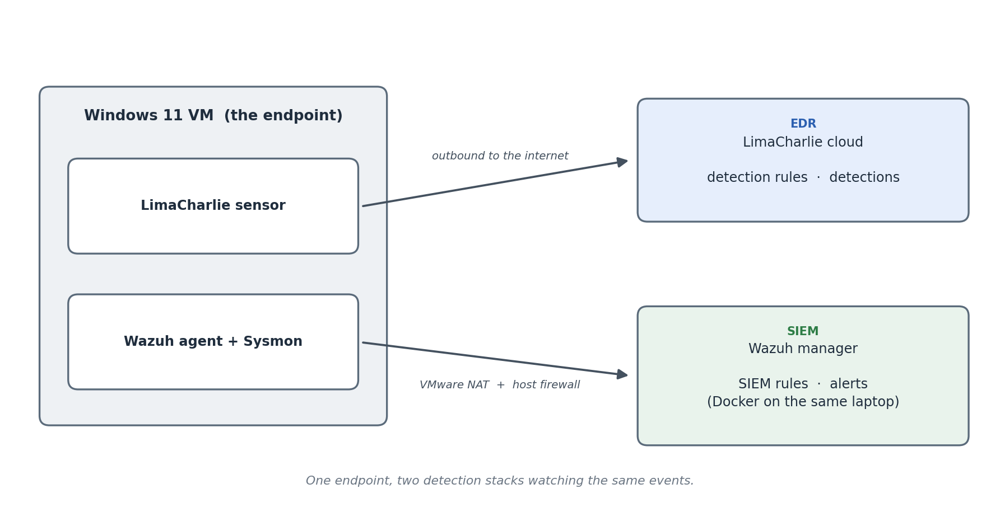
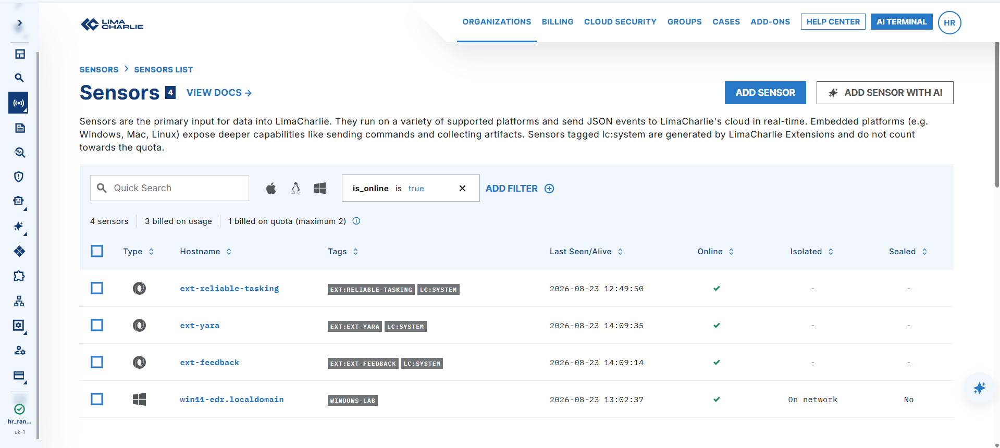
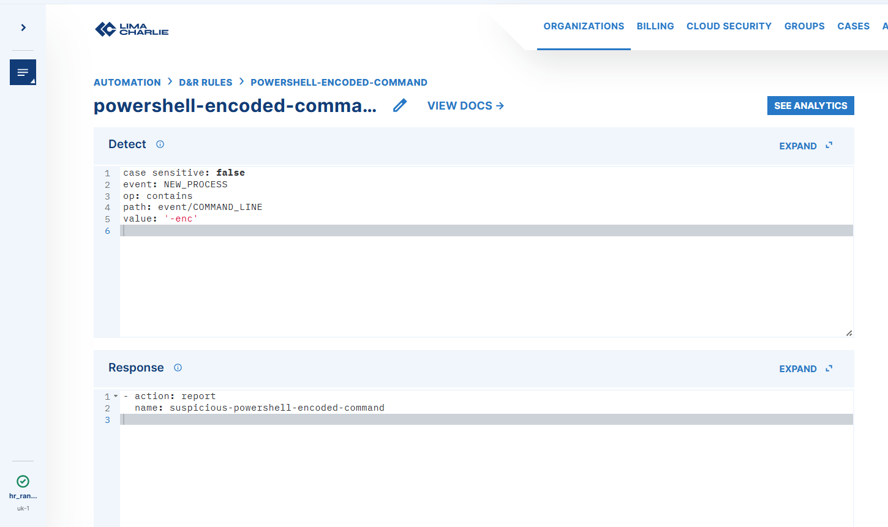
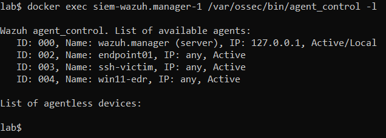
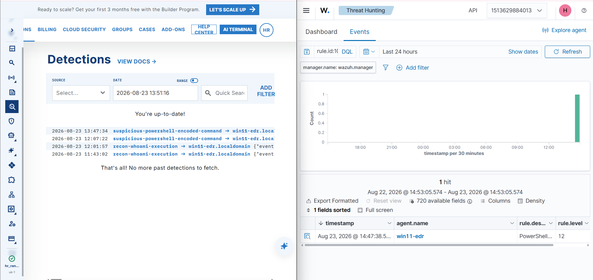

# Endpoint Detection with LimaCharlie

My SIEM reads log files. This project adds a tool that watches the machine itself, and then points both of them at the same computer.

An EDR sensor sits on a Windows machine and records what it actually does: every process that starts, its full command line, who its parent was. I wrote detection rules for it, then put a second agent on the same machine so my existing SIEM watches it too. The result is one attack, seen through two very different lenses at once: the endpoint's own view, and the log stream's view.

The interesting part was getting them onto the same machine. The endpoint is a virtual machine, the SIEM runs in containers on the host, and nothing about the network between them worked on the first try.

## Contents

- [Technology stack](#technology-stack)
- [Architecture](#architecture)
- [1. Putting an EDR sensor on a Windows machine](#1-putting-an-edr-sensor-on-a-windows-machine)
- [2. Writing detection rules](#2-writing-detection-rules)
- [3. Connecting the same machine to the SIEM](#3-connecting-the-same-machine-to-the-siem)
- [4. Catching one attack with both tools](#4-catching-one-attack-with-both-tools)
- [Problems encountered](#problems-encountered)
- [Verification](#verification)
- [Lessons learned](#lessons-learned)
- [Limitations](#limitations)
- [Reproducing the lab](#reproducing-the-lab)

## Technology stack

| Tool | What I used it for |
|---|---|
| LimaCharlie | The cloud EDR: the sensor on the endpoint and the detection rules |
| VMware Workstation 17 | Running the Windows 11 machine I watch and attack |
| Windows 11 Pro | The endpoint |
| Sysmon | Recording detailed process activity for the SIEM to read |
| Wazuh 4.14.5 | The SIEM from my earlier projects, now watching this machine as well |
| VMware NAT and Windows Firewall | The network path between the endpoint and the SIEM |

EDR stands for Endpoint Detection and Response. A SIEM collects logs from many machines and looks for trouble across all of them. An EDR does the opposite: it sits on one machine and watches what that machine does in detail, which lets it see things a log never records, like which process started which other process.

## Architecture



```
   Windows 11 VM  (the endpoint)
   |
   |-- LimaCharlie sensor ------------------->  LimaCharlie cloud
   |                                            (detection rules, detections)
   |
   |-- Wazuh agent + Sysmon --+
                              |  over VMware NAT and the host firewall
                              v
                        Wazuh manager
                        (SIEM rules, alerts, in Docker on the same laptop)
```

The endpoint runs two agents at once. The **LimaCharlie sensor** talks outward to the LimaCharlie cloud, where the detection rules live. The **Wazuh agent** talks inward to the Wazuh manager, which runs in Docker on the same laptop that hosts the virtual machine.

That inward path is the whole trick of the project. The virtual machine is on its own network, the SIEM is inside Docker inside a Linux layer on the host, and getting a connection from one to the other is written up in [section 3](#3-connecting-the-same-machine-to-the-siem).

**Sysmon** is what makes the comparison fair. Windows does not record process command lines by default, so on its own the SIEM would be half blind next to the EDR. Sysmon is a free Microsoft tool that logs detailed process activity, and the Wazuh agent reads that log. With it in place, both tools are genuinely watching the same events.

## 1. Putting an EDR sensor on a Windows machine

The endpoint is a Windows 11 machine running inside VMware. I installed the LimaCharlie sensor on it with a single installer and an installation key. Within a few seconds it appeared in the LimaCharlie console as an online sensor, using one of the two that the free plan allows.



Once it was online I could watch its live activity: processes starting, files being written, users logging on. Running `whoami` in a terminal showed up straight away as a new process, with its full path, the account that ran it, and the process that launched it.

Two things stood out from just watching.

**A signed program is not a safe program.** Windows tools like `whoami`, `net` and `wmic` are all signed by Microsoft, so a check that only asks "is this signed" would wave them through. But those same tools are exactly what an intruder uses to look around a machine after breaking in, because they are already present and raise no alarms. Using trusted tools for untrusted purposes has a name: living off the land.

**An EDR records who launched what.** Every process event carried the identity of its parent. A log tells you a program ran. The EDR tells you a program ran, and that a Word document started it, which is the difference between noise and a lead.

## 2. Writing detection rules

LimaCharlie's rules have two halves: a **detect** part that describes what to look for, and a **respond** part that says what to do when it matches. I wrote two.

**Detecting reconnaissance.** The first rule fires when `whoami` runs, which maps to the technique an intruder uses to find out which account they have landed on (MITRE T1033). The console offered to build this rule for me from the example event, and its version is a good lesson in what not to do: it matched the exact file path, the exact command line, and the exact hostname, so it would only ever fire on this one machine running this one command, and would miss `whoami /all`. I replaced it with a rule that matches any process whose path ends in `whoami.exe`, regardless of machine or arguments. **Detect the technique, not the one example you happened to see.**

**Detecting hidden PowerShell.** The second rule is the one that matters. Attackers routinely run PowerShell with an encoded command, a `-enc` flag followed by a scrambled blob, so that what they are really doing is not readable at a glance. Ordinary administrators almost never do this by hand, so it is a strong signal (MITRE T1059.001 and T1027). This rule watches the command line rather than the program name, because the program, `powershell.exe`, is completely legitimate. The danger is in how it is being used.



That second rule is the one I later rebuilt inside the SIEM as well, so that both tools catch the same thing.

## 3. Connecting the same machine to the SIEM

To compare the EDR against the SIEM, the SIEM has to see the same machine. That meant putting a Wazuh agent on the endpoint and getting it to reach the Wazuh manager, which runs in Docker on the host.

On paper this is one setting: tell the agent the manager's address. In practice the connection was refused, and finding out why took most of the project's debugging.

The endpoint reaches the host over VMware's NAT network, where the host answers on `10.0.0.1`. The manager listens on port 1514 there. From the host itself, that port answered. From the endpoint, it did not. So the port was open, but something was refusing the endpoint's traffic specifically.

The cause was Windows Firewall, and the detail is worth keeping. The endpoint's network had no gateway, so Windows treated it as an unknown network and filed it under the strictest, most locked down profile. Docker Desktop adds its own rules that block incoming traffic on that profile. And in Windows Firewall a block always beats an allow, so the rule I had added to permit the traffic was being overruled by Docker's block. Switching those two Docker block rules off let the endpoint through, and the agent connected.

With the agent connected, I installed Sysmon on the endpoint and told the agent, through the manager's central configuration, to read Sysmon's log. From that point the SIEM was receiving the endpoint's process activity, command lines included.



## 4. Catching one attack with both tools

The last step was to make the SIEM detect the same encoded PowerShell that the EDR already caught. I wrote a Wazuh rule that watches Sysmon's process events and fires when a command line contains `-enc`:

```xml
<rule id="100100" level="12">
  <if_sid>61603</if_sid>
  <field name="win.eventdata.commandLine" type="pcre2">(?i)-enc</field>
  <description>PowerShell executed with an encoded command on $(win.system.computer)</description>
  <mitre>
    <id>T1059.001</id>
    <id>T1027</id>
  </mitre>
</rule>
```

`if_sid` 61603 is Wazuh's built in rule for "a process was created", so this rule only ever looks at process events, and only cares about the ones whose command line carries `-enc`. It is the same logic as the LimaCharlie rule, written for a different tool.

Then I ran the attack once, on the endpoint, and both tools caught it.

## Problems encountered

### The rule the console wrote for me only worked on one computer

LimaCharlie will build a rule for you from an example event. Its version of the `whoami` rule matched the exact path, the exact command line, and the exact hostname of the machine I tested on. It would have fired on nothing else. A different machine, or the same command with an option on the end, and it would have stayed silent.

**Convenience features describe the example in front of them, not the behaviour you actually want to catch.** The rule I kept matches any process ending in `whoami.exe`, on any machine, with any arguments.

### The endpoint could not reach the SIEM, and the rule I added to fix it did nothing

The agent would not connect. I worked through it rather than guessing, testing the connection from each side in turn.

From the host, the manager's port answered. From the endpoint, the same port timed out. That split the problem cleanly: the port was open and listening, so this was not the manager, it was something between the two machines refusing the endpoint.

It was Windows Firewall. I added a rule to allow the traffic, and it still failed. The reason is a piece of Windows behaviour worth knowing: **a block rule always wins over an allow rule.** The endpoint's network had no gateway, so Windows had quietly filed it under its most restrictive profile, and Docker Desktop keeps a pair of block rules on that profile. My allow could not override them. Turning those two block rules off let the endpoint connect.

**A test from the same machine can hide a fault that only a real connection from somewhere else reveals.** The host reaching its own port proved the manager was fine and pointed me straight at the network in between.

### A download that failed without saying anything

Downloading the agent with PowerShell's built in command produced no file and no error. It simply did nothing. The cause was an old default for secure connections that the download server no longer accepts, and the command failed silently rather than complaining.

Switching to `curl`, which Windows now ships with, worked at once and showed a real progress bar. **A command that fails silently costs more than one that fails loudly**, because you spend the first few minutes not even knowing it failed.

### Two stumbles bringing the SIEM up

Starting the SIEM after the machine had been off for a while hit two Docker problems in a row. The first was a port that Windows had reserved and not released, cleared by restarting the Windows networking service. The second was the manager trying to attach to a network that had been rebuilt with a new identity underneath it, cleared by tearing the stack down and bringing it back up so it reattached cleanly. Neither was a real fault, both were the host's networking getting into a stale state, and both are quick once you recognise them.

### The keyboard in the virtual machine could not type a backslash

A small one, but it shaped every command in the machine. The virtual machine's keyboard layout did not match the physical keyboard, so the backslash key produced the wrong character, and Windows paths are full of backslashes. I worked around it by staying in the home folder and referring to files by name, and by using forward slashes, which PowerShell accepts, wherever a path was unavoidable.

## Verification

### The SIEM was watching the endpoint

Before attacking anything, I confirmed the manager could actually see the new agent:

```
ID: 004, Name: win11-edr, IP: any, Active
```

The agent registered and reported as active, alongside the machines from the earlier projects.

### The same attack, caught by both tools

I then ran one attack on the endpoint, an encoded PowerShell command, and checked that each tool caught it independently.



| Tool | How it saw the attack |
|---|---|
| LimaCharlie (EDR) | Detection `suspicious-powershell-encoded-command` on `win11-edr` |
| Wazuh (SIEM) | Alert from rule 100100, level 12, on agent `win11-edr` |

Both name the same machine and the same technique. The EDR saw it through its own sensor; the SIEM saw it through Sysmon and the rule I wrote. The same run also shows the `whoami` reconnaissance rule firing on the LimaCharlie side.

One detail that looks wrong but is not: the two consoles show times an hour apart, because one displays local time and the other displays UTC. It is the same event, a few seconds apart in reality, not two different ones.

## Lessons learned

**Auto-generated detections describe the example, not the behaviour.** The rule the console built matched one machine running one exact command. A useful rule matches the technique wherever it appears.

**Signed does not mean safe.** The tools an intruder reaches for first are the ones already on the machine and already trusted. A detection that only asks whether a program is signed is not detecting much.

**An EDR and a SIEM see the same attack from different places.** The EDR watches the machine and gets process detail, including who launched what, for free. The SIEM watches logs and needs Sysmon before it can see the same process detail. Neither replaces the other, and running both is normal practice, not redundancy.

**In Windows Firewall, a block beats an allow.** Adding permission does nothing if a block rule already covers the same traffic. The fix is to find the block, not to add another allow.

**Test from where the problem actually is.** A machine reaching its own port proves the service works and nothing about whether anyone else can reach it. The refused connection only showed up from the other machine.

## Limitations

**The rules detect and alert, they do not respond.** Both LimaCharlie rules and the Wazuh rule raise a detection and stop there. An EDR can also isolate a machine or kill a process, and that automated response is not set up here. This project is about seeing the attack in two places, not acting on it.

**The free plan allows two sensors.** That is enough for one endpoint and room to spare, but it caps how far the EDR side of the lab can grow.

**The endpoint depends on the host's firewall state.** Docker Desktop puts its block rules back every time it restarts, so the endpoint's connection to the SIEM has to be re-enabled after a restart. It is a known step, not a mystery, but it is a manual one.

## Reproducing the lab

The detection rules are the substance of this project, and they are what this repository holds.

The LimaCharlie rules live in the LimaCharlie cloud rather than in a file here, the same way the earlier project's playbook lives inside its own platform. I have described both rules above rather than exporting them.

The SIEM side is in the repository:

```
stacks/siem/config/wazuh_cluster/
  local_rules.xml     rule 100100, the encoded-PowerShell rule for Sysmon events
```

### Notes

- The endpoint is a Windows 11 virtual machine in VMware, outside this repository. It runs the LimaCharlie sensor, the Wazuh agent, and Sysmon.
- Sysmon collection is turned on through the manager's central configuration, so the endpoint's own files are never edited by hand.
- The endpoint reaches the manager over VMware's NAT network. The host firewall has to allow the manager's ports from that network, and Docker Desktop's own block rules have to be off for it.
- No credentials or addresses that identify my network are stored here.
