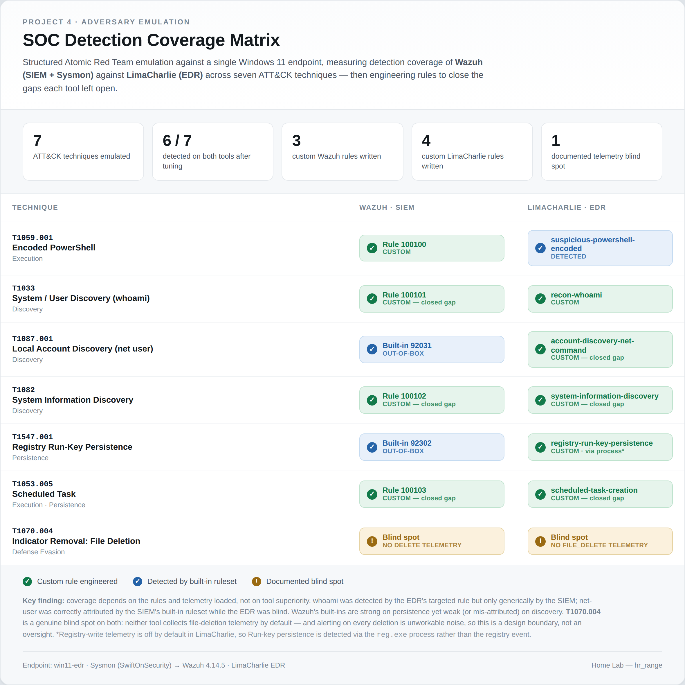
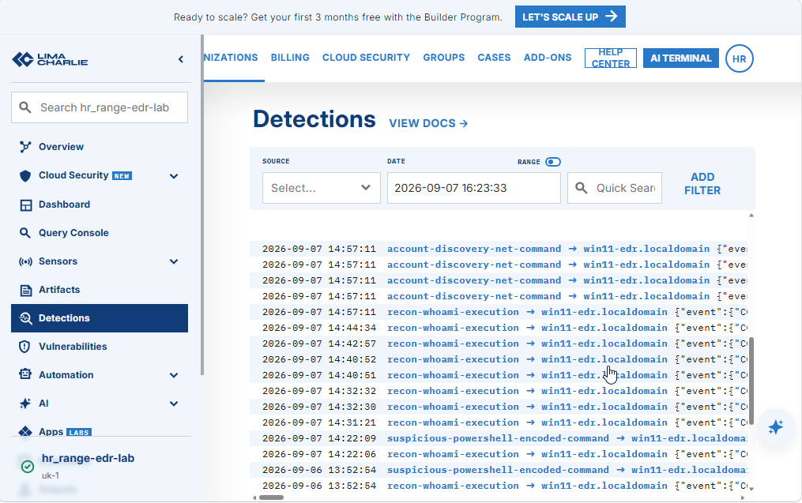
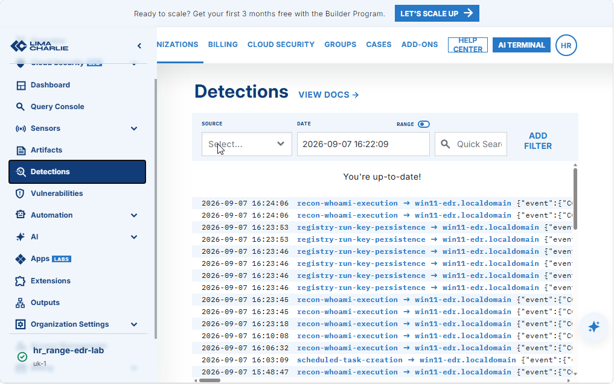
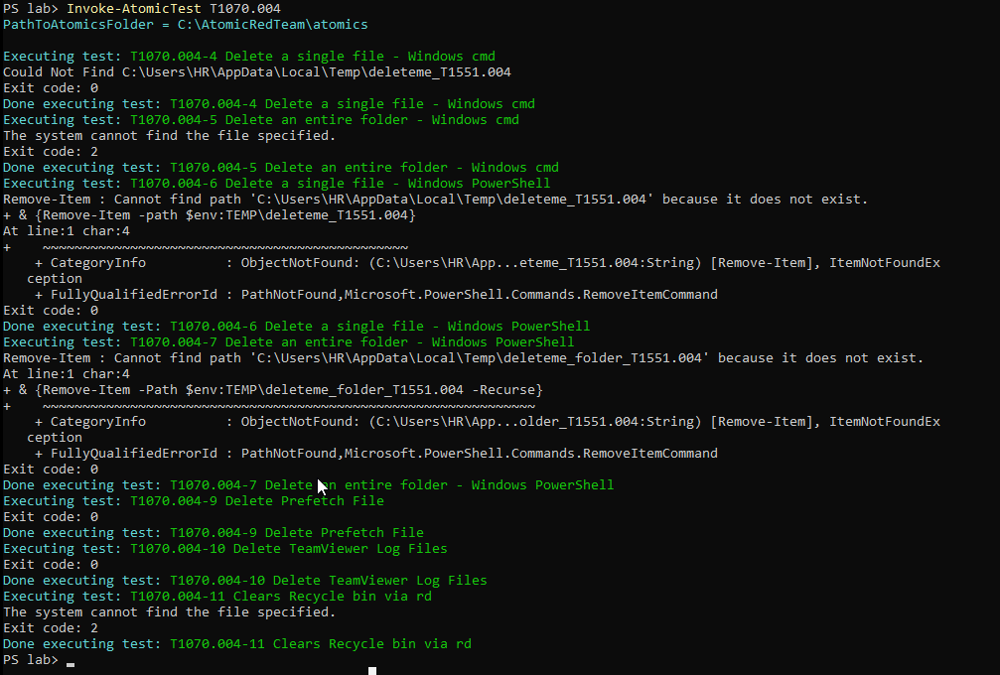
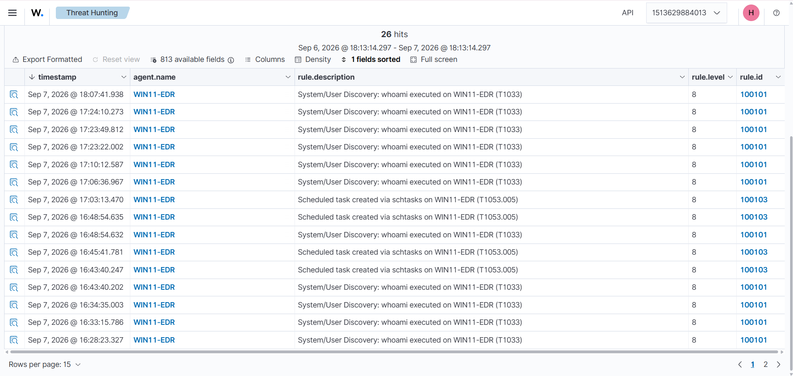
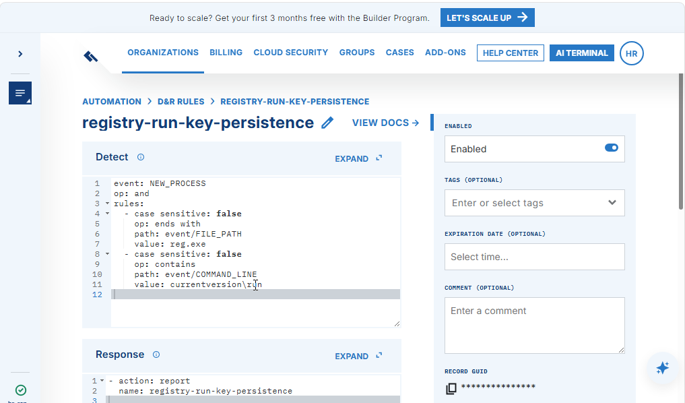
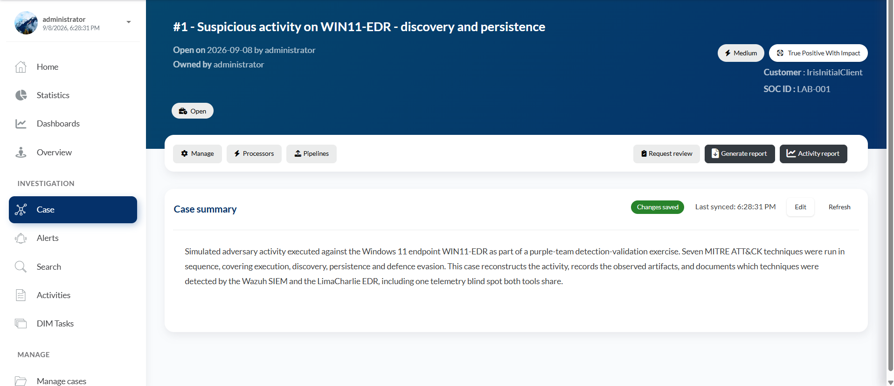
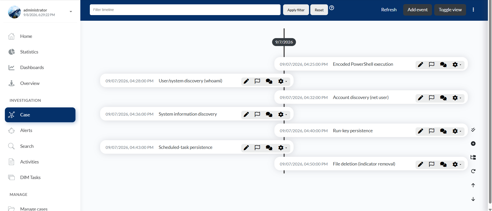
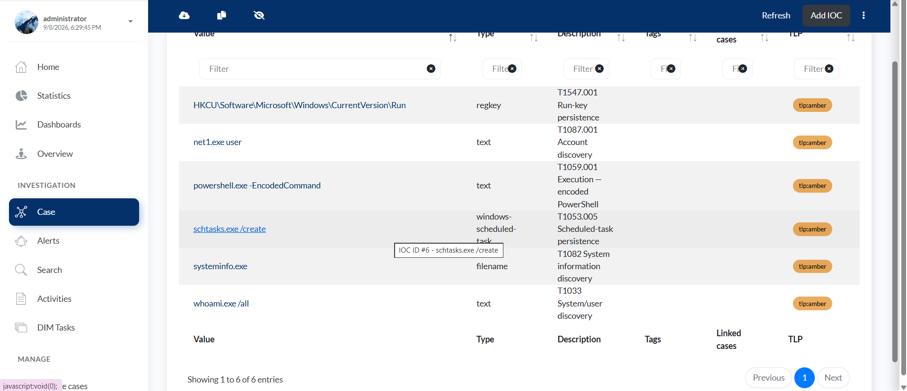

# Adversary Emulation and Case Management

I ran seven known attacker techniques against my own lab and measured what my SIEM and EDR each detected. Where a tool missed, I wrote a rule to close the gap and re-ran the technique to confirm the fix. I then worked the confirmed detections as a single incident case.

**Headline finding: neither tool was better than the other.** Coverage depended on the rules and telemetry each was configured with, and the gaps ran in both directions.

> Adversary emulation means running real attacker techniques, taken from MITRE ATT&CK (a public catalogue of attacker behaviour), against a machine you control to test whether your defences detect them. It is the defensive side of purple teaming.

## Contents

- [Technology stack](#technology-stack)
- [Coverage matrix](#coverage-matrix)
- [The techniques](#the-techniques)
- [Closing the gaps](#closing-the-gaps)
- [Working the detections as a case](#working-the-detections-as-a-case)
- [Problems and lessons](#problems-and-lessons)
- [Limitations](#limitations)
- [Reproducing the lab](#reproducing-the-lab)

## Technology stack

| Tool | Used for |
|---|---|
| Atomic Red Team | Running individual ATT&CK techniques as small, repeatable tests |
| MITRE ATT&CK | Naming each technique, so coverage is measurable |
| Wazuh 4.14.5 | The SIEM under test (from earlier projects) |
| LimaCharlie | The cloud EDR under test (from the previous project) |
| Sysmon | Supplying detailed process telemetry to the SIEM |
| Windows 11 in VMware | The endpoint (`win11-edr`), monitored by both tools at once |
| DFIR-IRIS | Case management, where the detections became a worked incident |

## Coverage matrix

The core of the project: seven techniques evaluated against two tools on the same endpoint.



| Technique | Wazuh (SIEM) | LimaCharlie (EDR) |
|---|---|---|
| T1059.001 encoded PowerShell | custom rule 100100 | built in |
| T1033 whoami | custom rule 100101 | custom rule `recon-whoami` |
| T1087.001 net user | built in rule 92031 | custom rule `account-discovery-net-command` |
| T1082 systeminfo | custom rule 100102 | custom rule `system-information-discovery` |
| T1547.001 Run key | built in rule 92302 | custom rule `registry-run-key-persistence` |
| T1053.005 scheduled task | custom rule 100103 | custom rule `scheduled-task-creation` |
| T1070.004 file deletion | not detected | not detected |

Six of the seven were detected by both tools after tuning. The significant part is where the gaps sat beforehand:

- **Discovery split in opposite directions.** For `whoami`, the EDR had a targeted rule while the SIEM produced only generic, mislabelled built-in alerts. For `net user` the position reversed: the SIEM attributed it correctly and the EDR detected nothing.
- **The Run key was a telemetry gap, not a rule gap.** The SIEM detected it. The EDR missed it because LimaCharlie does not collect registry writes by default, leaving no data for a rule to match.
- **File deletion was a shared blind spot.** Neither tool collects file-deletion events by default. I left it uncovered deliberately (see [Closing the gaps](#closing-the-gaps)).




## The techniques

Seven techniques, selected to span the stages of an intrusion rather than concentrate on one:

| Technique | Stage | What it does |
|---|---|---|
| T1059.001 | Execution | PowerShell run with a hidden, encoded command |
| T1033 | Discovery | `whoami`, checking which account you are |
| T1087.001 | Discovery | `net user`, listing accounts |
| T1082 | Discovery | `systeminfo`, reading machine details |
| T1547.001 | Persistence | a Run registry key, to relaunch at logon |
| T1053.005 | Persistence | a scheduled task, to relaunch on a trigger |
| T1070.004 | Defence evasion | deleting a file to remove evidence |

Each technique is a single Atomic Red Team test that executes the real command, which both tools then observe. For every technique I recorded the baseline result first (detected and correctly attributed, detected but generic, or missed) and only addressed gaps afterwards, so the matrix reflects out-of-the-box coverage.

> Windows Defender is configured with an exclusion on the Atomic Red Team folder so the tests execute. This measures detection rather than prevention, by design. It is a deliberate lab setting.



## Closing the gaps

For every miss I wrote a rule and re-ran the technique to confirm it fired. These custom rules are the primary output of the project.

- **3 custom Wazuh rules:** `whoami` (100101), `systeminfo` (100102), scheduled task (100103).
- **4 custom LimaCharlie rules:** account discovery, system information, Run key, scheduled task.

The `whoami` SIEM rule, as an example:

```xml
<rule id="100101" level="8">
  <if_sid>61603</if_sid>
  <field name="win.eventdata.originalFileName" type="pcre2">(?i)^whoami\.exe$</field>
  <description>System/User Discovery: whoami executed on $(win.system.computer) (T1033)</description>
  <mitre>
    <id>T1033</id>
  </mitre>
</rule>
```

It matches `originalFileName`, the internal name compiled into the executable, rather than the file name on disk. If `whoami.exe` is renamed to `safe.exe`, a path-based rule misses it while this rule still fires. **Match on what the attacker cannot easily rename.**

**File deletion is left uncovered deliberately.** A rule that alerts on every `del` produces noise rather than security, because files are deleted constantly during normal use. Effective detection of evidence removal targets specific artifacts, such as cleared event logs or deleted shadow copies, or correlates a deletion with a known compromise. Both tools default to not alerting on it, which is the correct behaviour, and I documented it as a deliberate blind spot rather than concealing it.




## Working the detections as a case

Detecting an attack is only half of the work. The other half is investigating it. I built one incident case in DFIR-IRIS, treating the entire emulation as a single intrusion rather than seven unrelated tickets.

- **Assets:** the affected host and account, establishing the scope.
- **Indicators:** the artifacts each technique left behind (the encoded command, the discovery commands, the Run key, the scheduled task), which could be hunted for on other hosts.
- **Timeline:** the seven techniques in attacker order, each annotated with the tool that detected it.
- **Tasks and ATT&CK tags:** the investigative actions, mapped back to the framework.





## Problems and lessons

**Problems worth keeping:**

- **The SIEM initially detected nothing.** Its Sysmon feed had broken after an earlier rebuild (an empty configuration and a stopped service), so every technique first appeared as a miss. A tool reporting nothing is not the same as a tool detecting nothing, so I confirmed the pipeline was working before trusting any result.
- **A rule fired on a loose match.** My encoded-PowerShell rule matched the string `-enc` inside a helper's parameter name rather than a genuine encoded command. It fired and the technique executed, but I recorded the caveat honestly; a stricter version would match an actual encoded payload.
- **The SIEM mislabelled techniques.** Several built-in rules fired but attributed the wrong ATT&CK ID. An alert with an incorrect label still misdirects the analyst.
- **IRIS attaches new items to the active case.** Everything initially landed on the platform's demo case, which was active without my realising.

**Lessons:**

- Coverage depends on rules and telemetry, not on which tool is better.
- A detection you have never fired is an assumption.
- Match on what cannot be renamed.
- Not everything should be detected. Knowing what to leave uncovered, and why, is part of the discipline.

## Limitations

- **Single techniques, not one connected attack.** Correlation across a chained intrusion belongs to my first project, not this one.
- **Prevention was set aside.** Defender was excluded so the tests would run, so this measures detection in isolation.
- **File deletion is uncovered by choice**, documented as a deliberate blind spot.
- **The case was built by hand** from the captured detections, not through a live SIEM-to-case integration, which would require both systems running at once.

## Reproducing the lab

The custom SIEM rules are held in the repository:

```
stacks/siem/config/wazuh_cluster/local_rules.xml
```

- 100100 detects encoded PowerShell (added in the previous project).
- 100101, 100102 and 100103 detect `whoami`, `systeminfo` and scheduled-task creation (new in this project).

The LimaCharlie rules reside in the LimaCharlie cloud and are described above. The IRIS case was built by hand from the captured detections. No credentials or network-identifying addresses are stored here.
